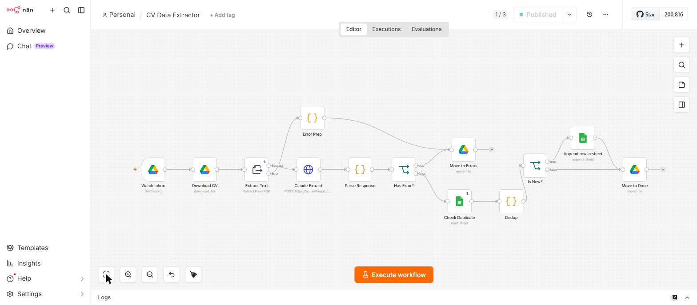
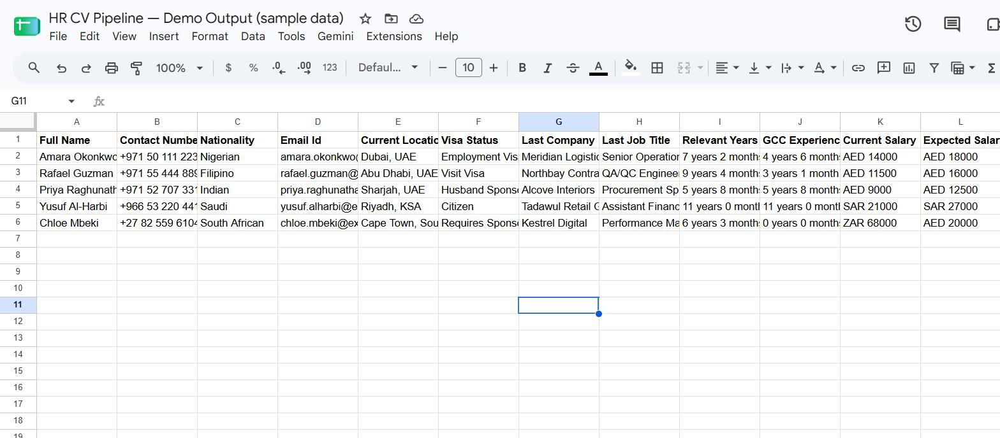

# 📄 HR CV Pipeline

Drop a CV into a Google Drive folder — get a structured candidate row in Google Sheets about a minute later. Built in n8n for a recruiter who was retyping 14 fields per résumé by hand, running 24/7 on a self-hosted VPS.

No UI to learn, no app to install. The recruiter's workflow is still "drag the PDFs into a folder"; everything after that is automated.

---

## Screenshots

**The workflow** — 13 nodes, three Drive folders acting as the queue:



**The output** — one row per candidate, deduplicated by email (sample data shown):



---

## Architecture

```
Google Drive /Inbox  (polled every minute)
        │
        ▼
   Watch Inbox  (Drive Trigger — fileCreated)
        │
        ▼
   Download CV
        │
        ▼
   Extract Text  (PDF → plain text)
        │
        ├──── extraction failed ──────┐
        ▼                             ▼
   Claude Extract               Error Prep
   (Haiku 4.5 → JSON)                 │
        │                             │
        ▼                             │
   Parse Response                     │
        │                             │
        ▼                             │
     Has Error? ──── yes ─────────────┴──▶ Move to /Errors
        │
        │ no
        ▼
   Check Duplicate  (read existing sheet rows)
        │
        ▼
     Dedup  (by email — vs sheet AND within batch)
        │
        ▼
     Is New? ──── no ────────────────────┐
        │                                │
        │ yes                            │
        ▼                                │
   Append row in sheet                   │
        │                                │
        ▼                                ▼
        └────────────▶ Move to /Done ◀───┘
```

Three Drive folders do the job a queue would: **Inbox** is work remaining, **Done** is processed, **Errors** is needs-a-human. A file is only ever in one of them.

---

## How it works

| # | Node | Type | What it does |
|---|------|------|--------------|
| 1 | Watch Inbox | Google Drive Trigger | Polls the Inbox folder every minute for `fileCreated` |
| 2 | Download CV | Google Drive | Downloads the binary by file ID |
| 3 | Extract Text | Extract From File | PDF → text. `onError: continueErrorOutput` |
| 4 | Claude Extract | HTTP Request | `POST /v1/messages` — Claude Haiku 4.5, 14-field extraction prompt |
| 5 | Parse Response | Code (per item) | Strips code fences, `JSON.parse`, attaches file metadata |
| 6 | Error Prep | Code (per item) | Builds an error record for PDFs that wouldn't extract |
| 7 | Has Error? | If | Routes parse/extract failures to the error branch |
| 8 | Move to Errors | Google Drive | Files the CV under /Errors for manual review |
| 9 | Check Duplicate | Google Sheets | Reads existing rows once (`executeOnce`) |
| 10 | Dedup | Code | Flags duplicates by email — against the sheet and within the batch |
| 11 | Is New? | If | Splits new candidates from repeats |
| 12 | Append row in sheet | Google Sheets | Writes the 16 mapped columns |
| 13 | Move to Done | Google Drive | Files the CV under /Done either way |

---

## Extracted fields

14 fields come from Claude; 2 are added by the pipeline.

| Column | Source | Notes |
|--------|--------|-------|
| Full Name | Claude | |
| Contact Number | Claude | Kept verbatim with country code |
| Nationality | Claude | |
| Email Id | Claude | Also the dedup key |
| Current Location | Claude | |
| Visa Status | Claude | |
| Last Company | Claude | Most recent role |
| Last Job Title | Claude | Most recent role |
| Relevant Years of Experience | Claude | **Derived** — earliest job → today, as `X years Y months` |
| GCC Experience | Claude | **Derived** — years in GCC countries only |
| Current Salary | Claude | |
| Expected Salary | Claude | |
| Notice Period | Claude | |
| Reason for Leaving | Claude | |
| Source File | pipeline | Original Drive filename, for traceability |
| Processed At | pipeline | ISO timestamp |

Column headers are in [`docs/sheet-template.csv`](docs/sheet-template.csv) — copy that header row into a new sheet to get started.

---

## Engineering notes

The parts that took the longest to get right, and why they're written the way they are.

**`Parse Response` runs once per item, not once per batch.** In n8n, `$('Watch Inbox').item` inside a `runOnceForAllItems` code node resolves to item 0 for *every* iteration. A batch of five CVs would all get tagged with the first file's name and ID — silently, with no error. Switching the node to `runOnceForEachItem` makes `$input.item` refer to the CV actually being processed.

**Phone numbers get a leading apostrophe.** Google Sheets parses `+971 50 111 2233` as a formula and returns `#ERROR!`. Prefixing with `'` forces text, and the apostrophe isn't displayed in the cell.

**A scanned CV files itself instead of killing the run.** `Extract Text` has `onError: continueErrorOutput`, so an image-only PDF takes the second output into `Error Prep` → `Move to Errors`. The recruiter finds it in a folder with a reason attached, and the other four CVs in that batch still process.

**Dedup runs at two levels.** `Check Duplicate` reads emails already in the sheet; `Dedup` checks each incoming candidate against that set *and* against a `seen` set built as it walks the batch. A single poll can deliver the same person twice (re-uploaded, or two agencies sending the same CV), and the sheet read happened before any of them were written.

**Duplicates still get moved to Done.** The `Is New?` false branch skips the sheet append but goes to `Move to Done` anyway. Otherwise a duplicate would sit in Inbox forever, re-triggering every minute.

**`binaryMode: separate`** keeps PDF binaries out of the execution payloads, so the n8n execution log stays small on a small VPS.

**Why an LLM instead of regex or spaCy.** CV layouts have no shared structure — two columns, tables, a header image, "Notice Period" written as "Availability". But the deciding factor was that two fields aren't extraction at all: *Relevant Years of Experience* and *GCC Experience* are **computed** from date ranges scattered across the employment history, with GCC filtered by country. A parser would need to find the dates, normalize a dozen formats, sort them, and know which countries are GCC. The prompt asks for it in one line.

---

## Cost

Claude Haiku 4.5 at $1.00 / $5.00 per million input / output tokens. A typical two-page CV is ~2.5K input tokens and ~300 output tokens:

**≈ $0.004 per CV — about $0.40 per 100 CVs.**

Runtime is roughly 15–30 seconds from drop to row, plus up to 60 seconds of polling latency.

---

## Setup

See **[SETUP.md](SETUP.md)** for the full walkthrough: Drive folders, the sheet, n8n credentials, and the six placeholders to replace in the workflow JSON.

The workflow itself is [`workflow/cv-data-extractor.json`](workflow/cv-data-extractor.json) — import it into any n8n instance.

---

## Stack

n8n (self-hosted, Docker) · Claude Haiku 4.5 · Google Drive API · Google Sheets API · Ubuntu VPS

## License

MIT — see [LICENSE](LICENSE).
